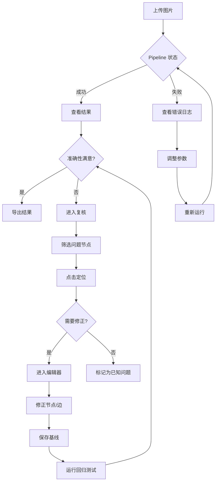

# OCR Pipeline 改进 PRD

## 一句话定位

> 这是一个给**需要处理超大思维导图图片的个人用户**使用的**桌面 Web 工具**，帮他们**将图片中的文字和结构提取为可编辑的结构化数据**。
> 与现有方案相比，核心差异是**离线运行 + 可视化复核 + 准确性回归测试闭环**。

## 产品形态

- **当前选型**：本地 Web 应用（单 HTML 文件，无需构建）
- **选择理由**：
  - 目标用户是个人开发者/研究者，熟悉本地工具
  - 无需部署服务器，双击 HTML 即可使用
  - 可集成现有 Python 后端（OCR 服务）
- **阶段策略**：先完善核心功能，后续可考虑打包为桌面应用

---

## 目标用户

### 核心用户画像

**个人知识管理者**
- 需要将手绘/扫描的思维导图数字化
- 有大量历史图片需要批量处理
- 对准确性有要求，愿意花时间校对
- 技术背景：熟悉 Python，能运行本地服务

### 核心痛点

1. **结构恢复不准确**：OCR 识别文字没问题，但节点之间的父子关系经常连错
2. **缺少可视化工具**：看不到 OCR 结果覆盖在原图上，无法快速定位问题
3. **校对效率低**：发现问题后要手动改 JSON，没有交互式编辑器
4. **不知道改进效果**：调参后不知道准确率是否提升，缺乏回归测试

---

## 核心功能方向

1. **统一 Dashboard 入口**：整合 CLI + HTML 工具为单一 Web 界面
2. **可视化结果复核**：图片 + SVG 叠加显示，支持筛选、搜索、定位
3. **准确性仪表盘**：回归测试结果可视化，突出显示问题区域
4. **交互式基线编辑器**：绘制/编辑节点、连接关系、运行 OCR

---

## 当前问题分析（基于回归测试）

### 准确性现状

| 指标 | 平均值 | 目标 | 差距 |
|------|--------|------|------|
| Block Recall | 100% | 95%+ | ✅ 已达标 |
| Node Recall | 100% | 95%+ | ✅ 已达标 |
| **Edge Recall** | **55.97%** | **90%+** | ❌ **核心问题** |

### Edge Recall 低的原因

1. **算法过于简单**：贪心最近邻 + dx/dy 距离 + 水平偏置
2. **未利用结构特征**：思维导图的层级关系、方向规律
3. **参数硬编码**：`max_parent_distance=1600` 对不同图片不适配
4. **无视觉线索检测**：原图中的连接线未利用

---

## 关键页面布局线框图

### 主界面布局

```
┌─────────────────────────────────────────────────────────────────────────┐
│  [Logo] OCR Pipeline                    [运行状态] [设置] [帮助] [主题]  │
├────────────┬────────────────────────────────────────────────────────────┤
│            │                                                             │
│  📤 上传   │   ┌─────────────────────────────────────────────────────┐  │
│            │   │  拖拽上传图片或点击选择                               │  │
│  📊 仪表盘 │   │  支持格式：JPG, PNG, BMP                             │  │
│            │   └─────────────────────────────────────────────────────┘  │
│  🔍 复核   │                                                             │
│            │   ┌─────────────────────────────────────────────────────┐  │
│  ✏️ 编辑器 │   │  Pipeline 进度                                       │  │
│            │   │  [████████░░░░░░░░░░░░] 60%  正在构建图谱...        │  │
│            │   │                                                      │  │
│            │   │  ✅ 预处理  ✅ 分块  ✅ OCR  ⏳ 合并  ⏳ 图谱  ○ 完成  │  │
│            │   └─────────────────────────────────────────────────────┘  │
│            │                                                             │
│            │   ┌─────────────────────┐ ┌─────────────────────────────┐  │
│            │   │  快速统计           │ │  最近处理                   │  │
│            │   │  节点: 1,234        │ │  GameEngine.jpg - 2分钟前   │  │
│            │   │  连边: 1,156        │ │  MindMap.png - 昨天         │  │
│            │   │  问题: 23           │ │  Notes.jpg - 3天前          │  │
│            │   └─────────────────────┘ └─────────────────────────────┘  │
└────────────┴────────────────────────────────────────────────────────────┘
```

### 仪表盘页面

```
┌─────────────────────────────────────────────────────────────────────────┐
│  准确性仪表盘                                    [运行回归测试] [导出]   │
├─────────────────────────────────────────────────────────────────────────┤
│                                                                         │
│  ┌─────────────────────────────────────────────────────────────────┐   │
│  │                      核心指标卡片                                │   │
│  │  ┌─────────────┐  ┌─────────────┐  ┌─────────────┐              │   │
│  │  │  Block      │  │  Node       │  │  Edge       │              │   │
│  │  │  Recall     │  │  Recall     │  │  Recall     │  ⚠️ 需关注   │   │
│  │  │   100%      │  │   100%      │  │   55.97%    │              │   │
│  │  │   ✅ 达标   │  │   ✅ 达标   │  │   ❌ 未达标 │              │   │
│  │  └─────────────┘  └─────────────┘  └─────────────┘              │   │
│  └─────────────────────────────────────────────────────────────────┘   │
│                                                                         │
│  ┌─────────────────────────────────────────────────────────────────┐   │
│  │  区域详情                                                        │   │
│  │                                                                  │   │
│  │  region_01  ████████████████████ Block=1.0 Node=1.0 Edge=0.0    │   │
│  │  region_02  ███████████████████░ Block=1.0 Node=1.0 Edge=0.29   │   │
│  │  region_03  ███████████████████░ Block=1.0 Node=1.0 Edge=0.5    │   │
│  │  region_04  ███████████████████░ Block=1.0 Node=1.0 Edge=0.67   │   │
│  │  region_05  ███████████████████░ Block=1.0 Node=1.0 Edge=0.63   │   │
│  │  region_06  ████████████████████ Block=1.0 Node=1.0 Edge=1.0 ✅  │   │
│  │  region_07  ███████████████████░ Block=1.0 Node=1.0 Edge=0.6    │   │
│  │  region_08  ███████████████████░ Block=1.0 Node=1.0 Edge=0.8    │   │
│  │                                                                  │   │
│  └─────────────────────────────────────────────────────────────────┘   │
│                                                                         │
│  ┌─────────────────────────────────────────────────────────────────┐   │
│  │  失败案例                                                        │   │
│  │  ┌──────────────────────────────────────────────────────────┐   │   │
│  │  │  [缩略图] region_01                                       │   │   │
│  │  │  问题: Edge Recall = 0% (期望 5 条边, 识别 0 条)          │   │   │
│  │  │  [查看详情] [编辑基线]                                     │   │   │
│  │  └──────────────────────────────────────────────────────────┘   │   │
│  └─────────────────────────────────────────────────────────────────┘   │
│                                                                         │
└─────────────────────────────────────────────────────────────────────────┘
```

### 复核页面

```
┌─────────────────────────────────────────────────────────────────────────┐
│  结果复核                                                                │
├────────────┬────────────────────────────────────────────────────────────┤
│            │                                                             │
│  筛选      │   ┌─────────────────────────────────────────────────────┐  │
│            │   │  [缩放滑块] [适应窗口] [实际大小] [下载]             │  │
│  🔍 搜索.. │   ├─────────────────────────────────────────────────────┤  │
│            │   │                                                     │  │
│  显示层    │   │                                                     │  │
│  ☑ Blocks │   │         [图片 + SVG 叠加层]                          │  │
│  ☑ Nodes  │   │                                                     │  │
│  ☑ Edges  │   │         点击节点查看详情                             │  │
│  ☐ Roots  │   │         拖拽平移 / 滚轮缩放                          │  │
│            │   │                                                     │  │
│  问题类型  │   │                                                     │  │
│  ○ 全部    │   │                                                     │  │
│  ○ 孤立节点│   │                                                     │  │
│  ○ 低置信度│   │                                                     │  │
│  ○ 超大节点│   │   └─────────────────────────────────────────────────────┘  │
│  ○ 弱连接  │                                                             │
│            │   ┌─────────────────────────────────────────────────────┐  │
│  问题清单  │   │  节点详情                                           │  │
│            │   │  ┌─────────────────────────────────────────────┐    │  │
│  孤立节点  │   │  │  ID: node_00123                             │    │  │
│  ├ node_42 │   │  │  文本: 核心概念                              │    │  │
│  ├ node_87 │   │  │  置信度: 0.87                               │    │  │
│  └ node_91 │   │  │  父节点: node_00001                          │    │  │
│            │   │  │  子节点: node_00124, node_00125             │    │  │
│  低置信度  │   │  │  边分数: 0.72                               │    │  │
│  ├ node_15 │   │  └─────────────────────────────────────────────┘    │  │
│  └ node_33 │   │                                                     │  │
│            │   └─────────────────────────────────────────────────────┘  │
└────────────┴────────────────────────────────────────────────────────────┘
```

### 编辑器页面

```
┌─────────────────────────────────────────────────────────────────────────┐
│  基线编辑器                              [状态: 就绪] [保存] [导出]      │
├────────────┬────────────────────────────────────────────────────────────┤
│            │                                                             │
│  当前模式  │   ┌─────────────────────────────────────────────────────┐  │
│            │   │  [缩放滑块] [适应窗口]                               │  │
│  ┌──────┐  │   ├─────────────────────────────────────────────────────┤  │
│  │ 绘制 │  │   │                                                     │  │
│  └──────┘  │   │                                                     │  │
│  连接      │   │         [区域图片 + SVG 编辑层]                      │  │
│  合并      │   │                                                     │  │
│  设父节点  │   │         绘制模式: 拖拽创建矩形节点                    │  │
│  填充OCR   │   │         连接模式: 先点父节点，再点子节点              │  │
│            │   │                                                     │  │
│  操作      │   │                                                     │  │
│            │   │                                                     │  │
│  [删除节点]│   └─────────────────────────────────────────────────────┘  │
│  [删除边]  │                                                             │
│  [撤销]    │   ┌─────────────────────────────────────────────────────┐  │
│  [重置]    │   │  当前节点                                           │  │
│            │   │  ┌─────────────────────────────────────────────┐    │  │
│  节点列表  │   │  │  ID: manual_node_001                         │    │  │
│            │   │  │  文本: [可编辑文本框]                        │    │  │
│  node_001  │   │  │  父节点: [下拉选择]                          │    │  │
│  node_002  │   │  │  子节点: node_002, node_003                  │    │  │
│  node_003  │   │  └─────────────────────────────────────────────┘    │  │
│            │   │                                                     │  │
│  边列表    │   │  OCR 候选                                           │  │
│            │   │  ┌─────────────────────────────────────────────┐    │  │
│  node_001  │   │  │  [替换文本] [追加文本]                        │    │  │
│    →       │   │  │  ☑ 核心概念 (0.95)                           │    │  │
│  node_002  │   │  │  ☑ 关键要点 (0.89)                           │    │  │
│            │   │  │  ☐ 补充说明 (0.76)                           │    │  │
│            │   │  └─────────────────────────────────────────────┘    │  │
│            │   └─────────────────────────────────────────────────────┘  │
└────────────┴────────────────────────────────────────────────────────────┘
```

---

## 核心用户动线



---

## 功能清单

```
OCR Pipeline Dashboard
├── 🔴 上传与 Pipeline 控制（核心，MVP 必须有）
│   ├── 图片上传（拖拽 + 点击）
│   ├── Pipeline 进度显示
│   ├── 参数配置面板
│   └── 结果快速预览
├── 🔴 准确性仪表盘（核心，MVP 必须有）
│   ├── 核心指标卡片（Block/Node/Edge Recall）
│   ├── 区域详情列表（带进度条）
│   ├── 失败案例缩略图
│   └── 回归测试触发
├── 🔴 结果复核（核心，MVP 必须有）
│   ├── 图片 + SVG 叠加显示
│   ├── 节点/边/块筛选
│   ├── 问题类型过滤
│   ├── 搜索功能
│   └── 节点详情面板
├── 🔴 基线编辑器（核心，MVP 必须有）
│   ├── 绘制节点模式
│   ├── 连接节点模式
│   ├── 合并节点模式
│   ├── 设置父节点模式
│   ├── 填充 OCR 文本
│   ├── 撤销/重置
│   └── 导出 JSON
├── 🟡 改进建议（重要，后续迭代）
│   ├── 算法调参建议
│   ├── 问题根因分析
│   └── 一键优化按钮
└── ⚪ 未来规划
    ├── 批量处理队列
    ├── 历史记录管理
    └── 结果对比视图
```

---

## 功能详细描述

### 🔴 上传与 Pipeline 控制

**功能描述**：用户上传图片后，自动或手动触发 OCR Pipeline，实时显示处理进度。

**触发条件**：用户拖拽或选择图片文件后。

**交互细节**：

| 场景 | 交互处理方式 |
|------|------------|
| 拖拽文件 | 拖拽区域高亮，显示"释放以上传" |
| 上传中 | 显示进度条 + 文件大小 |
| Pipeline 运行 | 分步骤显示进度，每个步骤可点击展开日志 |
| Pipeline 失败 | 红色提示 + 错误信息 + 重试按钮 |
| 空状态 | 显示拖拽区域 + 示例图片链接 |

**状态清单**：

| 状态 | 触发条件 | UI 表现 | 用户可执行操作 |
|------|---------|---------|-------------|
| 空闲 | 页面加载完成 | 显示上传区域 | 上传图片 |
| 上传中 | 用户选择文件 | 进度条 | 取消上传 |
| 排队 | Pipeline 等待中 | 显示队列位置 | 取消排队 |
| 处理中 | Pipeline 运行 | 步骤进度条 + 当前步骤名称 | 取消处理 |
| 成功 | Pipeline 完成 | 绿色提示 + 快速统计卡片 | 查看结果、运行回归 |
| 失败 | Pipeline 出错 | 红色提示 + 错误日志 | 查看日志、重试 |

**边界条件**：

- 文件格式不支持：提示支持的格式列表
- 文件过大（>100MB）：警告用户可能处理缓慢
- 网络错误：提示检查后端服务状态

---

### 🔴 准确性仪表盘

**功能描述**：展示回归测试结果，突出显示准确性差距，帮助用户快速定位问题区域。

**触发条件**：用户运行回归测试后，或打开已有测试结果。

**交互细节**：

| 场景 | 交互处理方式 |
|------|------------|
| 指标卡片悬停 | 显示详细解释 tooltip |
| 未达标指标 | 红色背景 + ⚠️ 图标 + 脉冲动画 |
| 区域行悬停 | 高亮对应行，显示操作按钮 |
| 点击失败案例 | 跳转到编辑器，打开对应区域 |

**状态清单**：

| 状态 | 触发条件 | UI 表现 | 用户可执行操作 |
|------|---------|---------|-------------|
| 无数据 | 未运行测试 | 提示运行回归测试 | 运行测试 |
| 加载中 | 测试运行 | 骨架屏 + 进度提示 | 取消 |
| 有数据 | 测试完成 | 显示完整仪表盘 | 查看详情、编辑基线 |
| 数据过期 | 基线已更新 | 提示"基线已变更，建议重新测试" | 重新测试 |

---

### 🔴 结果复核

**功能描述**：可视化展示 OCR 结果，用户可筛选、搜索、定位问题节点。

**触发条件**：Pipeline 完成后自动进入，或从导航进入。

**交互细节**：

| 场景 | 交互处理方式 |
|------|------------|
| 节点悬停 | 高亮节点边框，显示简要信息 tooltip |
| 节点点击 | 选中节点，右侧面板显示详情 |
| 边悬停 | 高亮边，显示连接信息 |
| 问题项点击 | 自动定位到对应节点，居中显示 |
| 缩放/平移 | 鼠标滚轮缩放，拖拽平移 |

**状态清单**：

| 状态 | 触发条件 | UI 表现 | 用户可执行操作 |
|------|---------|---------|-------------|
| 空闲 | 页面加载完成 | 显示上一次结果 | 上传新图片 |
| 加载中 | 图片/数据加载 | 骨架屏 | 无 |
| 已选中节点 | 用户点击节点 | 节点高亮 + 详情面板 | 编辑、跳转到编辑器 |
| 已选中边 | 用户点击边 | 边高亮 + 连接信息 | 删除边 |
| 筛选后 | 应用筛选条件 | 仅显示符合条件的节点/边 | 清除筛选 |

---

### 🔴 基线编辑器

**功能描述**：交互式创建/编辑基线标注数据，支持绘制节点、连接边、运行 OCR。

**触发条件**：从仪表盘点击"编辑基线"，或从导航进入。

**交互细节**：

| 场景 | 交互处理方式 |
|------|------------|
| 模式切换 | 顶部显示当前模式，模式按钮高亮 + 提示文字 |
| 绘制节点 | 鼠标拖拽创建矩形，松开后自动运行 OCR |
| 连接节点 | 第一次点击选中父节点，第二次点击子节点完成连接 |
| 合并节点 | 先选中目标节点，再点击要合并的节点 |
| 运行 OCR | 显示 loading，完成后显示候选文本列表 |

**状态清单**：

| 状态 | 触发条件 | UI 表现 | 用户可执行操作 |
|------|---------|---------|-------------|
| 就绪 | 页面加载完成 | 状态栏显示"就绪" | 切换模式、上传 JSON |
| 绘制中 | 绘制模式 + 鼠标按下 | 虚线矩形跟随鼠标 | 松开完成绘制 |
| 连接中 | 连接模式 + 第一次点击 | 提示"点击子节点" | 点击子节点或取消 |
| OCR 运行中 | 点击运行 OCR | loading 动画 + "正在识别..." | 无 |
| 已修改 | 数据变更 | 状态栏显示"未保存" | 保存、重置 |

**边界条件**：

- OCR 服务不可用：提示启动后端服务，显示命令
- 合并到自己：忽略操作
- 连接到自己：忽略操作
- 导出时无变更：直接下载，无需确认

---

## 文案规范

### 产品整体文案风格

**风格基调**：简洁直接 + 技术专业

- 面向开发者/研究者，不需要过多解释
- 状态信息要精确，避免模糊表达
- 中英文混用时，专业术语用英文

### 面向终端用户的产品文案

| 场景 | 文案内容 | 风格备注 |
|------|---------|---------|
| 页面标题 | OCR Pipeline | 简洁，产品名 |
| 上传区域 | 拖拽图片到这里，或点击选择 | 引导性 |
| Pipeline 进度 | 正在处理: 构建图谱 (3/5) | 精确状态 |
| 成功提示 | 处理完成：1,234 个节点，1,156 条边 | 具体数据 |
| 错误提示 | OCR 服务未启动，请运行 `uv run ocr-pipeline serve-editor-ocr` | 给出解决方案 |
| 加载中提示 | 正在加载图片... | 让用户知道系统在工作 |
| 危险操作确认 | 确定要重置吗？所有未保存的修改将丢失。 | 清楚说明后果 |
| 空状态标题 | 还没有处理记录 | 友好但简洁 |
| 空状态按钮 | 上传第一张图片 | 引导行动 |
| 指标解释 | Edge Recall: 正确识别的边数 / 期望边数 | 技术 but 清晰 |
| 模式提示 | 绘制模式：拖拽创建节点 | 明确操作方式 |

---

## 非功能性需求

### 性能要求

- 图片加载：首屏 < 2s（对于 10MB 以下图片）
- Pipeline 进度更新：实时，延迟 < 500ms
- 节点筛选：即时响应，< 100ms
- 10,000+ 节点：保持流畅，无明显卡顿

### 兼容性

- 浏览器：Chrome 100+, Edge 100+, Firefox 100+
- 分辨率：最小 1280×720，推荐 1920×1080
- 操作系统：Windows 10+, macOS 12+

### 数据安全

- 所有处理在本地完成
- 不上传任何数据到外部服务器
- 用户数据仅存储在本地 artifacts 目录

### 数据存储

- 处理结果存储在 `artifacts/` 目录
- 基线数据存储在 `baseline/` 目录
- 回归报告存储在 `artifacts/reports/` 目录
- 用户可通过界面导出/导入 JSON

---

## 待确认问题

- [ ] 是否需要暗色模式？（建议：是，作为切换选项）不需要
- [ ] 是否需要批量处理队列？（建议：后续迭代）不需要
- [ ] 历史记录是否需要持久化到 localStorage？（建议：是，最多保留 20 条）需要
- [ ] 是否需要支持多语言？（建议：暂不需要，目标用户是中文用户）不需要

---

## UI 设计风格说明

### 配色方案

基于现有 warm tones 进行扩展：

```css
:root {
  /* 背景色 */
  --bg-primary: #f4efe5;      /* 主背景，温暖的米色 */
  --bg-secondary: #fffdf8;    /* 卡片背景，更亮的米色 */
  --bg-tertiary: #e8e2d6;     /* 次级背景 */
  
  /* 文字色 */
  --text-primary: #201b16;    /* 主文字，深棕色 */
  --text-secondary: #75695f;  /* 次级文字 */
  --text-muted: #a89f94;      /* 弱化文字 */
  
  /* 强调色 */
  --accent-primary: #0f766e;  /* 主强调色，深青色 */
  --accent-secondary: #14b8a6; /* 次级强调色，亮青色 */
  
  /* 状态色 */
  --status-success: #16a34a;  /* 成功，绿色 */
  --status-warning: #f59e0b;  /* 警告，橙色 */
  --status-error: #b91c1c;    /* 错误，红色 */
  --status-info: #2563eb;     /* 信息，蓝色 */
  
  /* 边框和分隔线 */
  --border-primary: #d8d1c1;  /* 主边框色 */
  --border-secondary: #ebe6dc; /* 次级边框色 */
  
  /* 阴影 */
  --shadow-sm: 0 1px 2px rgba(32, 27, 22, 0.05);
  --shadow-md: 0 4px 6px rgba(32, 27, 22, 0.08);
  --shadow-lg: 0 10px 20px rgba(32, 27, 22, 0.12);
  
  /* 圆角 */
  --radius-sm: 6px;
  --radius-md: 10px;
  --radius-lg: 16px;
  --radius-xl: 24px;
}
```

### 字体方案

```css
:root {
  /* 标题字体 */
  --font-display: "Noto Serif SC", "Source Han Serif SC", Georgia, serif;
  
  /* UI 字体 */
  --font-ui: "Noto Sans SC", "Source Han Sans SC", "Segoe UI", sans-serif;
  
  /* 等宽字体（代码/数据） */
  --font-mono: "JetBrains Mono", "Fira Code", monospace;
}
```

### 关键 UI 组件

1. **模式切换器**：高亮当前模式 + 状态栏提示
2. **进度条**：分步骤显示 + 当前步骤名称
3. **指标卡片**：大数字 + 状态图标 + 趋势指示
4. **区域进度条**：多色进度条（Block/Node/Edge 三色）
5. **图片查看器**：缩放/平移 + 图层控制 + 全屏

---

## 实现优先级

### Phase 1：MVP（1-2 周）

1. 统一 HTML 框架 + 导航结构
2. 上传与 Pipeline 控制
3. 结果复核（整合现有 reviewer）
4. 基线编辑器（整合现有 editor）

### Phase 2：准确性仪表盘（1 周）

1. 回归测试结果可视化
2. 失败案例详情
3. 区域对比视图

### Phase 3：体验优化（1 周）

1. 性能优化（大图片）
2. 键盘快捷键
3. 导入/导出优化
4. 历史记录

---

## 验证方式

1. **功能验证**：按照核心用户动线逐流程测试
2. **准确性验证**：运行回归测试，确认 Edge Recall 目标提升至 90%+
3. **性能验证**：测试 10,000+ 节点图片的流畅度
4. **可用性验证**：让目标用户试用，收集反馈
