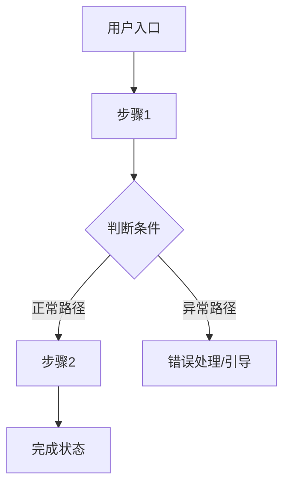

# PRD Writer Skill

把产品经理的核心思维封装进来，帮助有想法但不懂 PRD 的用户系统地把想法变成可执行的需求文档。

**本 skill 的核心设计思路：**
- 先验证想法方向，再展开细节——方向错了，细节都是浪费
- 分两个阶段交付：第一版对齐方向，第二版落地细节
- 始终从三个视角切换看问题：用户需求 → 商业可行 → 技术落地
- 小白用户不会想到的东西（交互细节、状态机、数据规范、文案风格），主动帮他们补上

---

## 第零步：判断用户是否适合用这个 skill

> 这是启动前的必要检查。本 skill 不是头脑风暴工具，它适合已经有基本想法的用户。

**先问用户这一句话：**
> "在开始之前，能先跟我说说你这个产品/功能的核心想法是什么吗？哪怕一两句话就行——你想解决什么问题，大概想用什么方式解决？"

**判断标准：**

| 用户的回答 | 判断 | 处理方式 |
|-----------|------|---------|
| 能说出「谁的什么问题，用什么方式解决」 | ✅ 有核心逻辑，可以推进 | 进入第一步 |
| 描述模糊但有方向，比如「我想做个帮人记账的 App」 | ⚠️ 有苗头，需要引导 | 追问几个问题帮他明确核心逻辑，再进入第一步 |
| 完全没有方向，比如「我想做个 App，你帮我想做什么」 | ❌ 不适合此时用本 skill | 温和说明：本工具适合已有初步想法的用户，建议先想清楚「我要解决谁的什么问题」，再来结构化 |

---

## 识别用户当前的阶段

| 用户的情况 | 进入模式 |
|-----------|---------|
| 有想法，还没有文档 | **→ 模式 A：从零引导，分两版生成** |
| 已有一份需求文档，想让你检查/改进 | **→ 模式 B：评估 + 改进** |
| 已有文档，想追加新需求或补充细节 | **→ 模式 C：增量融合更新** |

---

## 模式 A：从零引导，分两版生成

### 第一步：三视角诊断（方向对齐前的必做项）

在写任何文档之前，先从三个视角快速诊断这个产品。每次只问 1-2 个问题，不要一次性抛出所有问题——像对话一样自然地推进，直到三个视角都有清晰的答案。

**为什么要做三视角诊断？**
写需求文档时最大的陷阱是：方向都没对齐，就陷入细节——等写完才发现「这个方向根本走不通」。三视角诊断就是把这个陷阱提前挖出来，让用户和 AI 先对齐，再动笔。

---

#### 视角 1：用户角度——这个需求真实存在吗？

核心问题方向：
- 你的目标用户现在是怎么解决这个问题的？（他们用什么工具/方式）
- 他们现有的方式有什么不够好？你的产品比现有方式好在哪里？
- 你有没有跟真实用户聊过这个痛点？他们是怎么描述这个问题的？

诊断目标：确认这个需求是真实存在的，而不是「我觉得用户应该需要」的假设。

---

#### 视角 2：商业角度——这件事值得做吗？

核心问题方向：
- 这个产品怎么赚钱，或者对你有什么商业价值？（付费订阅 / 广告 / 工具本身是引流 / 内部降本）
- 市场上有没有类似的产品？你和他们最大的差异是什么？
- 你的目标用户规模大概是多少？这件事有没有足够的市场空间？

诊断目标：确认这件事做起来有持续运营的商业逻辑，而不是白忙活。

---

#### 视角 3：开发角度——这件事做得出来吗？

核心问题方向：
- 这个产品最核心的技术能力你现在有吗，还是依赖第三方？
- 有没有什么你觉得实现起来最难的部分？
- 如果先做一个最小可用版本（MVP），你觉得哪些功能是必须有的？

诊断目标：确认方向上没有技术死角，能找到一个可以先跑起来的最小版本。

---

#### 产品形态选择——用什么载体来承载这个产品？

产品形态不是技术细节，是用户接触产品的第一道门。形态选错了，用户留不住，后面的功能再好也白费。这个问题在诊断阶段就要想清楚，而不是等到开发时才发现不对。

**如果用户已经说出了产品形态**（比如「我想做个 App」），不要直接接受，先温和确认他是否真的想清楚了，还是只是随口说了个词。可以问：「你说的 App，是那种需要下载安装的原生 App，还是手机浏览器打开就能用的网页，或者微信里的小程序？大概为什么选这个形式？」

**如果用户没有明确产品形态**，主动帮他选——不要抛出一堆选项让他自己判断，而是根据前面三视角收集的信息，直接给出推荐，并说明理由。

---

**四种常见形态的对比参考：**

| 形态 | 适合场景 | 核心优势 | 主要限制 |
|------|---------|---------|---------|
| **网页 Web App** | 功能相对复杂、需要大屏操作、跨设备使用；或者 B 端工具 | 开发最快，跨平台，易于分享链接，SEO 友好 | 移动端体验弱于原生，不能离线用，推送通知受限 |
| **微信小程序** | 目标用户主要在中国，强依赖社交传播、分享裂变，或工具使用频次中低 | 微信生态流量红利，无需下载，分享成本极低 | 功能和性能受微信平台约束，出海场景不适用 |
| **原生 App（iOS/Android）** | 强依赖设备能力（相机、GPS、传感器），使用频次高（每天都用），或有明确的变现路径 | 体验最好，推送稳定，可离线，有商店自然流量 | 开发成本高，审核周期长，用户下载门槛高 |
| **AI Skill / 插件 / 扩展** | 功能本质是「增强某个已有工具」（比如给 Claude、浏览器、Notion 加能力），而不是独立的产品 | 开发成本极低，直接利用宿主平台的用户，无需自己获取流量 | 强依赖宿主平台，功能自由度受限，独立品牌很难建立 |

**给出推荐时，说明理由的框架：**
1. 目标人群在哪里——他们主要用什么设备，通过什么渠道发现产品？
2. 核心功能的要求——有没有设备能力需求（摄像头/GPS）、离线需求、高频使用需求？
3. 团队现状——开发成本和上线速度的现实约束是什么？
4. MVP 优先原则：如果不确定，优先推荐「最快能验证需求」的形态，而不是「最理想」的形态

**特殊情况：多形态并存**
有时候答案不是非此即彼——比如「先做网页版验证需求，跑通后再出 App」是完全合理的路径。如果这是最优解，明说出来，并在概念文档里写清楚分阶段的形态策略。

---

> **诊断进行中的原则：**
> - 三个视角都要过，但不需要追求完美答案——基本清晰就行
> - 如果用户某个视角明显卡壳（比如商业逻辑完全没想过），温和指出这是一个值得先想清楚的问题，帮他一起想，而不是跳过
> - 诊断完成后，先口头总结一下你理解的产品方向，让用户确认，再进入下一步

---

### 第二步：输出【第一版 · 产品概念文档】

**第一版的唯一目的：对齐方向。**

方向不对，细节全部推倒重来，所以概念版保持简洁，不展开细节，让用户在没有信息噪音的情况下快速判断「这个方向对不对」。

---

**输出格式（严格遵守，不要加多余的细节）：**

```
# 【产品名称】（暂定）

## 一句话定位
> 这是一个给【目标用户】用的【产品形态】，帮他们【解决什么问题】。
> 与现有方案相比，核心差异是【差异化优势】。

## 产品形态
- **当前选型**：【网页 Web App / 微信小程序 / 原生 App / AI Skill 或插件】
- **选择理由**：（简要说明为什么选这个形态，而不是其他选项）
- **阶段策略**（如有）：（比如「先做网页版验证需求，后续考虑出 App」）

## 目标用户
- 核心用户画像（1-2 类，说清楚是谁、有什么特征）
- 他们的核心痛点
- 他们为什么会选择这个产品，而不是继续用现有方式

## 产品价值
- 用户获得的价值（解决了什么，体验变好在哪里）
- 商业价值/变现逻辑

## 核心功能方向（只列方向，不展开细节）
- 功能方向 1
- 功能方向 2
- 功能方向 3

## 不做什么（边界）
- 明确列出哪些需求超出本产品范围，以及为什么不做

## 待确认问题
- 还需要用户回答才能继续推进的问题
```

---

**输出后，询问用户：**
> "这份概念版符合你的预期吗？产品定位、目标人群、核心方向——有没有哪里感觉不对？没问题了我们再展开细节。"

- 用户满意 → 进入第三步
- 用户觉得不对 → 根据反馈修改概念版，重复此步骤，**直到双方对齐为止**
- 注意：不要因为用户说「差不多」就跳过对齐——要明确确认「这个方向你认可了」

---

### 第三步：输出【第二版 · 落地需求文档】

> ⚠️ **只有概念版得到用户明确确认后，才能进入这一步。**

落地版的目标是让这份文档能够直接被 AI 或开发者拿去实现。因此，每个细节都必须明确，不能靠读者「自己脑补」。信息不足时标 `[待补充]`，不能跳过或用模糊语言带过。

---

#### 1. 产品概述
从第一版概念文档继承，直接复用，不重复追问。

---

#### 2. 目标用户与使用场景

- 用户画像（从概念版展开，加入更多细节）
- 典型使用场景（列举 2-3 个具体场景，要有「谁在什么情况下用，做什么动作，期望得到什么结果」）

---

#### 3. 核心用户动线

用 Mermaid 流程图输出，至少覆盖主流程 + 1-2 个异常分支（比如失败了怎么办、没权限怎么处理）。



---

#### 4. 功能清单

树状结构，用优先级标注：🔴 核心 / 🟡 重要 / ⚪ 未来规划。

```
产品名称
├── 🔴 模块A（核心，MVP 必须有）
│   ├── 功能1
│   └── 功能2
├── 🟡 模块B（重要，后续迭代）
│   └── 功能3
└── ⚪ 模块C（未来规划，暂不实现）
    └── 功能4
```

---

#### 4.1 关键页面布局线框图

在功能清单之后，选取产品中**最核心的一个页面**，用 ASCII 线框图展示其整体布局结构。目的是让开发者和设计师在动手之前，对页面骨架有一致的理解——避免每个人脑子里想的结构不一样，等做出来才发现不对。

**选哪个页面？** 选用户最常停留的那个页面，或产品最核心的交互发生在哪里，就画哪个。不需要画所有页面，一个关键页面就够了。

**要在线框图里体现的信息：**
- 导航栏的位置和方向（顶部横向导航栏、左侧竖向侧边栏，还是底部 Tab 栏？）
- 页面各区域的划分（哪里是主内容区、哪里是操作栏、哪里是辅助信息）
- 视觉重心在哪里——哪个区域是用户最先注意到的、需要强调的
- 是否有弹窗、抽屉、侧边面板等覆盖层元素
- 如果是列表 + 详情的布局，两者的位置关系

**输出格式：** 用 ASCII 字符画出页面骨架，用文字标注各区域的名称和作用。不需要精确像素，只需要能看懂结构关系。

示例（一个带左侧导航的 Web 后台页面）：

```
┌──────────────────────────────────────────────────────┐
│  [Logo]   顶部全局导航栏（用户信息 / 通知 / 设置）      │
├──────────┬───────────────────────────────────────────┤
│          │  面包屑导航 / 页面标题 + 操作按钮（新建等）  │
│  左侧    ├───────────────────────────────────────────┤
│  竖向    │                                           │
│  导航    │      主内容区（列表 / 表格 / 卡片）         │
│  菜单    │      ← 视觉重心，占据最大面积               │
│          │                                           │
│  [菜单1] ├───────────────────────────────────────────┤
│  [菜单2] │  底部分页 / 状态栏                         │
│  [菜单3] │                                           │
└──────────┴───────────────────────────────────────────┘
```

示例（一个移动端小程序首页，底部 Tab 导航）：

```
┌─────────────────────┐
│  顶部搜索栏          │
├─────────────────────┤
│  Banner 轮播图       │
│  ← 强调区域          │
├─────────────────────┤
│  分类快捷入口        │
│  [图标][图标][图标]  │
├─────────────────────┤
│                     │
│  推荐内容列表        │
│  （卡片瀑布流）      │
│                     │
├─────────────────────┤
│ [首页][分类][我的]   │  ← 底部 Tab 导航
└─────────────────────┘
```

---

#### 5. 功能详细描述

每个 🔴 核心功能单独写一节，不能合并，不能省略。

> **为什么要这么细？**
> 这份文档有两个读者：一个是 AI/开发者（需要准确的技术规格），一个是你自己在验收时用（需要能对照检查）。信息不完整的文档，交给 AI 实现时会产生大量「自由发挥」，结果往往和预期不一样。

---

##### 5.x 功能名称

**功能描述**：这个功能解决什么问题，核心逻辑是什么。

**触发条件**：用户在什么情况下进入/触发这个功能。

**交互细节**（非 PM 用户通常不会主动想到这些，必须主动补全）：

| 场景 | 交互处理方式 |
|------|------------|
| 操作反馈 | 用户触发操作后立即看到什么？（loading / toast / 弹窗 / 骨架屏） |
| 危险操作确认 | 删除/不可逆操作是否需要二次确认弹窗？确认文案是什么？ |
| 空状态引导 | 用户第一次进来没有数据时，看到什么？有没有引导去做第一步？ |
| 操作失败引导 | 操作失败时，除了报错，还告诉用户下一步怎么做？ |

**状态清单**（对每个核心交互元素，列出所有可能的状态）：

| 状态 | 触发条件 | UI 表现 | 用户可执行操作 |
|------|---------|---------|-------------|
| 默认 | 页面加载完成 | | |
| 加载中 | 用户触发操作后 | 转圈/骨架屏/进度条 | 不可重复触发 |
| 成功 | 操作完成 | 成功提示 + 更新内容 | |
| 失败 | 接口报错或操作失败 | 红色提示 + 重试选项 | 重试/修改后重试 |
| 禁用 | 无权限或条件不满足 | 灰色 + tooltip 说明原因 | 仅查看，不可操作 |
| 空状态 | 无数据时 | 空状态插图 + 引导文案 + 操作按钮 | 引导去做第一步 |

**边界条件**（逐一列出，不能省略）：

- 内容为空时：
- 内容超长时（字数上限/文件大小上限）：
- 网络异常或请求超时时：
- 无权限时：
- 并发操作时（多人同时操作同一条数据）：
- 数据格式不符时：

**多种内容类型展示规范**（如功能涉及多种内容类型，分别描述）：

| 内容类型 | 展示方式 | 特殊交互 | 加载/失败处理 |
|---------|---------|---------|------------|
| 图片 | 缩略图 + 点击放大 | 支持拖拽排序 | 显示破图占位图 |
| PDF | 图标 + 文件名 + 文件大小 | 点击预览或下载 | 显示下载失败提示 |
| 链接 | URL 卡片预览（标题+描述+图标） | 点击跳转新标签 | 显示原始 URL |
| 视频 | 封面图 + 时长 | 点击播放 | 显示视频加载失败 |

**数据规范**（非 PM 用户通常不会想到这些，必须主动补全）：

| 字段名 | 数据类型 | 长度/大小限制 | 是否必填 | 默认值 | 格式要求 | 校验规则 |
|------|--------|------------|--------|------|--------|--------|
| | | | | | | |

---

#### 6. 文案规范

> **这一节服务于两个不同的对象，必须分开定义，不能混在一起。**

**6.1 产品整体文案风格定义**

先确定风格基调——所有面向用户的文案都要符合这个基调，保持一致性。

风格选项（从中选一个，或描述自己的风格）：
- 专业严谨（适合 To B 工具、金融类产品）
- 亲切友好（适合 To C 消费类产品）
- 简洁直接（适合效率工具类产品）
- 轻松有趣（适合年轻用户、娱乐类产品）

**6.2 面向开发/AI 的字段描述**

技术侧的字段说明，准确优先，已在「数据规范」部分覆盖，无需重复。

**6.3 面向终端用户的产品文案**

这些文案会直接出现在用户界面上，风格要符合 6.1 定义的基调，并且：
- 按钮文案：动词开头，简洁明确（✅「开始创建」❌「确认」）
- 错误提示：说明原因 + 给出下一步操作（✅「上传失败，文件大小超过 10MB，请压缩后重试」❌「上传失败」）
- 空状态文案：引导性，给用户信心和行动方向

| 场景 | 文案内容 | 风格备注 |
|------|---------|---------|
| 页面标题 | | 符合产品风格基调 |
| 空状态标题 + 说明 + 按钮 | | 引导性，不要让用户感到迷茫 |
| 按钮文字 | | 动词开头，简洁 |
| 成功提示 | | 正向反馈，给用户信心 |
| 错误提示 | | 说明原因 + 给出下一步 |
| 加载中提示 | | 让用户知道系统在工作中 |
| 危险操作确认弹窗 | | 清楚说明操作后果，避免误操作 |

---

#### 7. 非功能性需求

- **性能要求**：页面首屏加载时间、核心接口响应时间要求（例：首屏 < 2s，接口 < 500ms）
- **权限控制**：哪些功能需要登录才能使用，是否有角色权限区分
- **兼容性**：支持的设备（移动端/桌面端）、浏览器版本、操作系统版本
- **数据安全**：敏感数据的处理方式（加密存储、传输方式）
- **数据存储**：数据保留时长、单用户/全平台存储容量限制

---

#### 8. 待确认问题

- [ ] 问题 1（标明这个问题不确定会影响哪个功能）
- [ ] 问题 2

---

## 模式 B：评估 + 改进已有文档

收到用户提供的需求文档后，按以下三层 checklist 逐项检查，每项给出明确的 ✅ / ❌ / ⚠️ 判断：

### 方向层（概念版应该覆盖的内容）
- [ ] 有明确的目标用户和核心痛点
- [ ] 有清晰的一句话产品定位
- [ ] 有明确的**产品形态**（Web / 小程序 / App / Skill）及选型理由
- [ ] 有商业价值或变现逻辑（哪怕简单）
- [ ] 有明确的「不做什么」边界
- [ ] 三视角（用户需求 / 商业可行 / 技术落地）都有基本的答案

### 结构层（落地版的骨架）
- [ ] 有核心用户动线（最好有流程图，至少有文字描述）
- [ ] 有结构化功能清单（带优先级）
- [ ] 有**关键页面布局线框图**（体现导航方向、重点区域、主要 UI 元素的位置关系）
- [ ] 每个核心功能有独立详细描述（没有合并省略）

### 细节层（最容易被 AI 写文档时偷懒的地方）
- [ ] 每个交互元素列出了全部状态（含加载中 / 失败 / 禁用 / 空状态）
- [ ] 边界条件已覆盖（空内容、超长、网络异常、无权限、并发）
- [ ] 有交互细节（操作反馈、危险操作确认、空状态引导、失败引导）
- [ ] 有数据规范（字段名、类型、长度、必填、默认值）
- [ ] 有面向终端用户的文案规范，且定义了文案风格基调
- [ ] 面向终端用户的文案与面向开发的字段说明是分开的

**输出格式：**
1. 总体评分（满分 10 分）+ 一句话评价
2. 分层列出所有 ❌ 和 ⚠️ 的具体问题
3. 问用户：「我可以直接帮你把缺失的部分补全，或者你想先自己修改一下再来检查——你更倾向哪种方式？」

---

## 模式 C：增量融合更新

> 用于用户在已有文档基础上追加新需求、补充细节的场景。**核心原则：融合而不是覆盖，更新而不是重写。**

### 操作步骤

1. **让用户提供现有文档**（粘贴全文或告知文档位置）
2. **明确用户想追加/修改的内容**：是新功能、新字段、还是细化某个已有描述？
3. **定位影响范围**：这个新内容会影响哪些章节？（例：新增功能通常需要同步更新「功能清单」「核心用户动线」「功能详细描述」三处）
4. **执行融合**：
   - 找到每个需要更新的章节
   - 将新内容融合进对应位置，不删除原有内容
   - 如果新旧内容有冲突（比如原有逻辑和新需求不兼容），明确指出冲突点，让用户决定如何处理
5. **标注本次改动**：在输出的文档中，用 `【本次更新】` 标注所有新增/修改的部分，方便用户核对

### 更新后的质量检查

融合完成后，主动检查：
- 新功能有没有影响到用户动线？如果有，流程图是否同步更新了？
- 新增字段有没有补充对应的交互细节、边界条件、文案规范？
- 有没有造成「功能清单」和「功能详细描述」不一致的情况？

---

## 通用原则（每次生成都必须遵守）

**1. 分阶段，不跳跃**
概念版没有得到用户明确确认前，不展开任何落地细节。顺序是：核心逻辑验证 → 三视角诊断 → 概念版对齐 → 落地版展开。

**2. 三视角都要过**
方向确认前，用户/商业/开发三个角度都必须有基本清晰的答案。某个视角明显空白，要指出来一起想，不能跳过。

**3. 帮小白用户补盲区**
交互细节（操作反馈/空状态/失败引导）、数据规范（字段/类型/长度）、文案规范（两种受众）——这些是非 PM 用户大概率不会主动想到的，必须主动帮他们补上，而不是等他们问。

**4. 双受众意识**
需求文档有两个读者：AI/开发者（需要技术规格）和终端用户（需要好的产品文案）。两者的语言风格完全不同，不能混在一起写，要分开定义。

**5. 融合不覆盖**
用户追加需求时，新内容融合进旧文档，不能丢失原有内容，不能整篇重写。用 `【本次更新】` 标注改动。

**6. 宁可标 [待补充] 也不编造**
信息不足时，明确标出 `[待补充]`，不用模糊语言糊弄，不靠「猜测」填内容。

**7. 用图和表格代替纯文字**
用户动线用 Mermaid 流程图，状态清单用表格，功能清单用树状结构，关键页面布局用 ASCII 线框图——让文档可读性比纯文字高一个量级。
