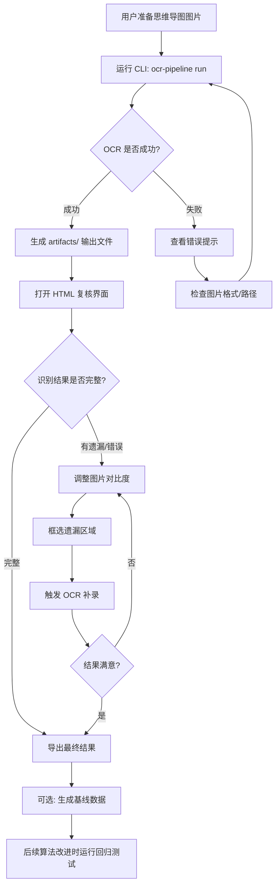

# OCR Pipeline 产品需求文档

## 1. 产品概述

### 一句话定位
这是一个给**需要数字化思维导图图片的个人用户**用的**离线 OCR 工具**，帮他们**准确还原思维导图的文本内容和层级结构**。与现有方案相比，核心差异是**自动化结构还原 + 交互式补漏 + 回归测试闭环**。

### 产品形态
- **当前选型**：CLI 工具 + HTML 复核界面
- **选择理由**：先验证核心算法和流程，CLI 开发效率高；后期再封装 GUI 降低使用门槛
- **阶段策略**：第一阶段 CLI 验证核心能力 → 第二阶段 GUI 界面提升易用性

### 边界
- 不支持暗模式图片
- 不支持中英文混合优化（默认中文）
- 不支持手写体识别
- 不支持实时 OCR（纯离线批处理）
- 不支持多用户/云端同步
- 不支持撤销操作（图像调整、框选 OCR）
- 不支持批量图片处理

---

## 2. 目标用户与使用场景

### 用户画像
- **身份**：个人知识管理爱好者、学习者
- **特征**：习惯用思维导图整理知识，有大量导图图片需要数字化存档
- **技术水平**：能使用命令行工具，了解基本的技术概念

### 典型使用场景

**场景 1：首次数字化一张思维导图**
> 用户有一张游戏引擎知识点的思维导图截图（4000x3000 像素），想要提取其中的文字和层级关系。用户运行 CLI 命令，自动得到 JSON 和 Markdown 格式的结构化数据。打开 HTML 复核界面，发现几处识别错误和遗漏，调整图片对比度后框选补录，最终得到完整的数字化结果。

**场景 2：算法改进后回归验证**
> 用户调整了 OCR 参数或结构还原算法，想确认改动没有破坏之前正确的识别结果。运行回归测试命令，对比基线数据，查看报告确认无回归问题。

---

## 3. 核心用户动线



---

## 4. 功能清单

```
OCR Pipeline
├── 🔴 核心流程（MVP 必须有）
│   ├── 图片预处理（验证格式、生成预览）
│   ├── 大图分块（自动切分、重叠区域处理）
│   ├── OCR 识别
│   ├── 结果合并去重
│   ├── 节点合并（多行文本聚合）
│   ├── 结构还原（父子关系推断）
│   └── 导出输出（JSON、Markdown、覆盖图）
│
├── 🔴 交互复核（MVP 必须有）
│   ├── HTML 复核界面
│   ├── 图像对比度调整
│   ├── 框选遗漏区域
│   ├── OCR 补录
│   └── 结果更新
│
├── 🟡 质量保障（重要）
│   ├── 问题检测（孤立节点、低置信度、弱连接）
│   ├── 基线数据生成
│   └── 回归测试
│
└── ⚪ 未来规划
    └── GUI 桌面应用
```

---

## 4.1 关键页面布局线框图

**HTML 复核界面**（用户最核心的交互页面）

```
┌──────────────────────────────────────────────────────────────────┐
│  [← 返回]   思维导图复核 - GameEngine.jpg            [导出结果]  │
├──────────────────────────────────────────────────────────────────┤
│  工具栏: [亮度 -] [亮度 +] [对比度 -] [对比度 +] [重置] [框选OCR] │
├──────────────────────────────────────────────────────────────────┤
│                                                                   │
│   ┌─────────────────────────────────────────────────────────┐    │
│   │                                                          │    │
│   │                                                          │    │
│   │              思维导图图片主视图                           │    │
│   │              （可缩放、可框选）                           │    │
│   │              ← 视觉重心                                   │    │
│   │                                                          │    │
│   │                                                          │    │
│   └─────────────────────────────────────────────────────────┘    │
│                                                                   │
├──────────────────────────────────────────────────────────────────┤
│  问题列表 (3)                                          [全部展开] │
│  ├─ ⚠️ 孤立节点: "渲染管线" (无父节点)                          │
│  ├─ ⚠️ 低置信度: "光照计算" (0.42)                              │
│  └─ ⚠️ 弱连接: "阴影" → "月影" (score: 0.31)                    │
├──────────────────────────────────────────────────────────────────┤
│  节点列表 (156)                                     [搜索: ____] │
│  ├─ 📁 亮度                                │
│  ├─ 📁 光通量                              │
│  └─ ...                                                        │
└──────────────────────────────────────────────────────────────────┘
```

---

## 5. 功能详细描述

### 5.1 图片预处理

**功能描述**：验证输入图片格式，生成预览图，为后续处理做准备。

**触发条件**：用户运行 `ocr-pipeline run` 或 `ocr-pipeline ocr` 命令。

**交互细节**：

| 场景 | 交互处理方式 |
|------|------------|
| 操作反馈 | CLI 输出 "预处理中..." 进度提示 |
| 文件不存在 | CLI 输出错误信息，退出码非 0 |
| 格式不支持 | CLI 输出支持的格式列表，退出码非 0 |

**状态清单**：

| 状态 | 触发条件 | UI 表现 | 用户可执行操作 |
|------|---------|---------|-------------|
| 默认 | 命令启动 | 无 | - |
| 处理中 | 正在验证 | CLI 输出 "预处理中..." | 等待 |
| 成功 | 验证通过 | CLI 输出 "预处理完成" | 继续下一步 |
| 失败 | 文件不存在/格式错误 | CLI 输出错误详情 | 修正后重试 |

**边界条件**：
- 文件不存在时：输出 "错误: 文件不存在 [路径]"
- 格式不支持时：输出 "错误: 不支持的图片格式，支持 [jpg/png/bmp]"
- 文件损坏时：输出 "错误: 图片文件损坏或无法读取"

---

### 5.2 大图分块 OCR

**功能描述**：将超大图片切分成重叠的图块，对每个图块运行 OCR，合并去重后输出识别结果。

**触发条件**：预处理完成后自动执行。

**交互细节**：

| 场景 | 交互处理方式 |
|------|------------|
| 操作反馈 | CLI 输出 "生成图块: X/Y"、"OCR 识别: X/Y" 进度 |
| 单图块失败 | 跳过该图块，继续处理其他图块，最后汇总警告 |

**状态清单**：

| 状态 | 触发条件 | UI 表现 | 用户可执行操作 |
|------|---------|---------|-------------|
| 默认 | 预处理完成 | - | - |
| 分块中 | 正在切分 | CLI 输出 "生成图块: X/Y" | 等待 |
| OCR 中 | 正在识别 | CLI 输出 "OCR 识别: X/Y" | 等待 |
| 成功 | 全部完成 | CLI 输出 "OCR 完成，识别 X 个文本块" | 查看结果 |
| 部分失败 | 部分图块失败 | CLI 输出警告信息 | 检查图片质量 |

**边界条件**：
- 图片尺寸小于分块大小时：直接整图 OCR，不切分
- 内存不足时：输出 "错误: 内存不足，尝试减小 tile_size 配置"
- OCR 引擎加载失败时：输出 "错误: OCR 引擎初始化失败，检查 PaddleOCR 安装"

---

### 5.3 结构还原

**功能描述**：基于空间位置推断节点间的父子关系，生成层级结构。

**触发条件**：OCR 完成后自动执行，或用户运行 `ocr-pipeline graph` 命令。

**交互细节**：

| 场景 | 交互处理方式 |
|------|------------|
| 操作反馈 | CLI 输出 "构建节点..."、"推断关系..." |
| 无 OCR 结果 | 输出警告 "警告: 无 OCR 结果，跳过结构还原" |

**状态清单**：

| 状态 | 触发条件 | UI 表现 | 用户可执行操作 |
|------|---------|---------|-------------|
| 默认 | OCR 完成 | - | - |
| 处理中 | 正在构建 | CLI 输出进度 | 等待 |
| 成功 | 构建完成 | CLI 输出 "生成 X 个节点，X 条边" | 查看结果 |
| 失败 | 无输入数据 | CLI 输出警告 | 先运行 OCR |

---

### 5.4 HTML 复核界面

**功能描述**：提供可视化界面，让用户查看识别结果、发现问题、调整图像、框选补漏。

**触发条件**：用户运行 `ocr-pipeline review-html` 命令，生成 HTML 文件后用浏览器打开。

**交互细节**：

| 场景 | 交互处理方式 |
|------|------------|
| 操作反馈 | 点击按钮后立即响应，OCR 操作显示 loading |
| 框选操作 | 鼠标拖拽绘制矩形框，松开后触发 OCR |
| 图像调整 | 按钮调整，实时预览效果 |

**状态清单**：

| 状态 | 触发条件 | UI 表现 | 用户可执行操作 |
|------|---------|---------|-------------|
| 默认 | 页面加载完成 | 显示原图 + 识别标注 | 缩放、框选、调整 |
| 加载中 | 触发 OCR | 显示 loading 动画 | 等待 |
| 成功 | OCR 完成 | 新增标注，更新节点列表 | 继续操作 |
| 失败 | OCR 错误 | 显示错误提示 | 重试或调整参数 |

**边界条件**：
- 框选区域过小时：提示 "框选区域过小，请扩大选择范围"
- OCR 无结果时：提示 "该区域未识别到文字"
- 图片加载失败时：显示 "图片加载失败，请检查路径"

---

### 5.5 图像调整 + 框选 OCR 补漏

**功能描述**：用户在复核界面调整图片对比度/亮度，框选遗漏区域触发 OCR 补录识别结果。

**触发条件**：用户在 HTML 复核界面中操作。

**交互细节**：

| 场景 | 交互处理方式 |
|------|------------|
| 调整对比度 | 点击 +/- 按钮，图片实时更新预览 |
| 框选补漏 | 鼠标拖拽绘制矩形，松开后自动触发 OCR |
| OCR 反馈 | 显示 loading，完成后在框选区域显示识别结果 |

**状态清单**：

| 状态 | 触发条件 | UI 表现 | 用户可执行操作 |
|------|---------|---------|-------------|
| 默认 | 显示原图 | 原始对比度 | 调整参数 |
| 调整中 | 点击调整按钮 | 图片实时更新 | 继续调整或重置 |
| 框选中 | 鼠标拖拽 | 显示矩形选框 | 松开触发 OCR |
| OCR 中 | 框选完成 | loading 动画 | 等待 |
| 成功 | OCR 完成 | 新增标注 + 提示 | 继续操作或导出 |
| 失败 | OCR 无结果 | 提示 "未识别到文字" | 调整后重试 |

**边界条件**：
- 对比度调整范围：-100 到 +100
- 框选区域最小尺寸：20x20 像素
- 连续 OCR 请求：防抖处理，避免频繁触发

---

### 5.6 回归测试

**功能描述**：对比当前识别结果与基线数据，检测算法改进是否引入回归问题。

**触发条件**：用户运行 `ocr-pipeline regression` 命令。

**交互细节**：

| 场景 | 交互处理方式 |
|------|------------|
| 操作反馈 | CLI 输出 "对比区域 X/Y..."、"生成报告..." |
| 无基线数据 | 输出 "错误: 未找到基线数据，请先运行 baseline-seed" |

**状态清单**：

| 状态 | 触发条件 | UI 表现 | 用户可执行操作 |
|------|---------|---------|-------------|
| 默认 | 命令启动 | - | - |
| 对比中 | 正在对比 | CLI 输出进度 | 等待 |
| 成功 | 对比完成 | CLI 输出摘要 + 报告路径 | 查看报告 |
| 失败 | 无基线 | CLI 输出错误 | 先生成基线 |

**边界条件**：
- 基线数据不存在时：输出错误提示
- 报告目录不存在时：自动创建

---

## 6. 文案规范

### 6.1 产品整体文案风格
**简洁直接**：适合效率工具类产品，信息密度高，无废话。

### 6.2 面向终端用户的文案

| 场景 | 文案内容 | 风格备注 |
|------|---------|---------|
| CLI 成功提示 | `✓ OCR 完成，识别 156 个文本块` | 简洁，带关键数据 |
| CLI 错误提示 | `✗ 错误: 文件不存在 GameEngine.jpg` | 明确原因 + 位置 |
| CLI 进度提示 | `OCR 识别: 3/8 图块` | 实时进度 |
| HTML 空状态 | `暂无识别结果，请先运行 OCR` | 引导下一步 |
| HTML 错误提示 | `该区域未识别到文字，请尝试调整对比度后重试` | 原因 + 解决方案 |
| 框选提示 | `松开鼠标触发 OCR` | 操作引导 |
| 导出成功 | `✓ 已导出到 artifacts/graph.json` | 明确输出位置 |

---

## 7. 非功能性需求

- **性能要求**：
  - 单张 4000x3000 图片全流程 < 5 分钟（CPU 模式）
  - HTML 复核界面首屏加载 < 2 秒

- **兼容性**：
  - 支持 Windows 10/11
  - 支持 Chrome/Edge 浏览器（HTML 复核界面）
  - 支持图片格式：jpg、png、bmp

- **数据存储**：
  - 所有输出文件存储在 `artifacts/` 目录
  - 基线数据存储在 `baseline/` 目录
  - 无用户数据上传，完全离线

- **可配置性**：
  - 分块大小、重叠比例、置信度阈值等参数可通过 `config.yaml` 调整
